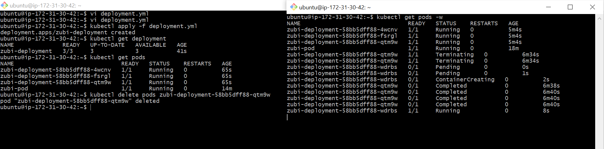
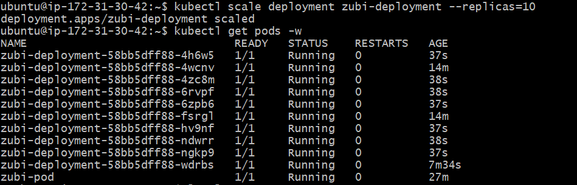

```markdown
# 🚀 Scalable Nginx Deployment on Kubernetes


## 📌 Project Overview
> This project demonstrates the deployment of a highly available, self-healing Nginx web server cluster using **Kubernetes**. It transitions from a basic single-pod setup to a production-ready **Deployment** with 10 replicas, showcasing the core strengths of container orchestration.

---

## 📸 Architecture & Verification

<p align="center">
  
  
</p>

* **Visual Proof**: The images above show the 10-replica Nginx army running within the Minikube cluster and the successful terminal status capture.

---

## ⚡ Key Features Demonstrated
* ✅ **Declarative Configuration**: Used YAML manifests to define the desired state of the cluster.
* 📈 **Scalability**: Demonstrated the ability to scale from 1 to 10 instances instantly using `kubectl scale`.
* 🛡️ **Self-Healing**: Verified that Kubernetes automatically detects and replaces failed or deleted pods to maintain the desired replica count.
* 🔍 **Resource Inspection**: Utilized `kubectl describe` and `kubectl logs` for deep-dive debugging and health monitoring.

---

## 🛠️ Technology Stack

| Category | Technology |
| :--- | :--- |
| **Cloud** | AWS EC2 (Ubuntu 22.04 LTS) |
| **Orchestration** | Kubernetes (Minikube) |
| **Runtime** | Docker |
| **CLI Tools** | `kubectl`, `git`, `minikube` |

---

## 📖 Step-by-Step Implementation

### 1️⃣ Environment Setup
The cluster was initialized using Minikube with a Docker driver on an AWS EC2 instance.
```bash
minikube start --driver=docker

```

### 2️⃣ Single Pod Deployment

Initial testing was performed using a standalone Pod (`pod.yaml`) to verify container connectivity.

```bash
kubectl apply -f pod.yaml

```

### 3️⃣ Production Scaling (Deployment)

To ensure high availability, a Deployment was created to manage a ReplicaSet.

```bash
kubectl apply -f deployment.yml
kubectl scale deployment zubi-deployment --replicas=10

```

### 4️⃣ Verification

Checked the status of the **"Army of Pods"** to ensure all instances were in the `Running` state.

```bash
kubectl get pods -o wide

```

---

**Author: Muhammad Zubair** *Kubernetes & DevOps Learning Journey*


```
